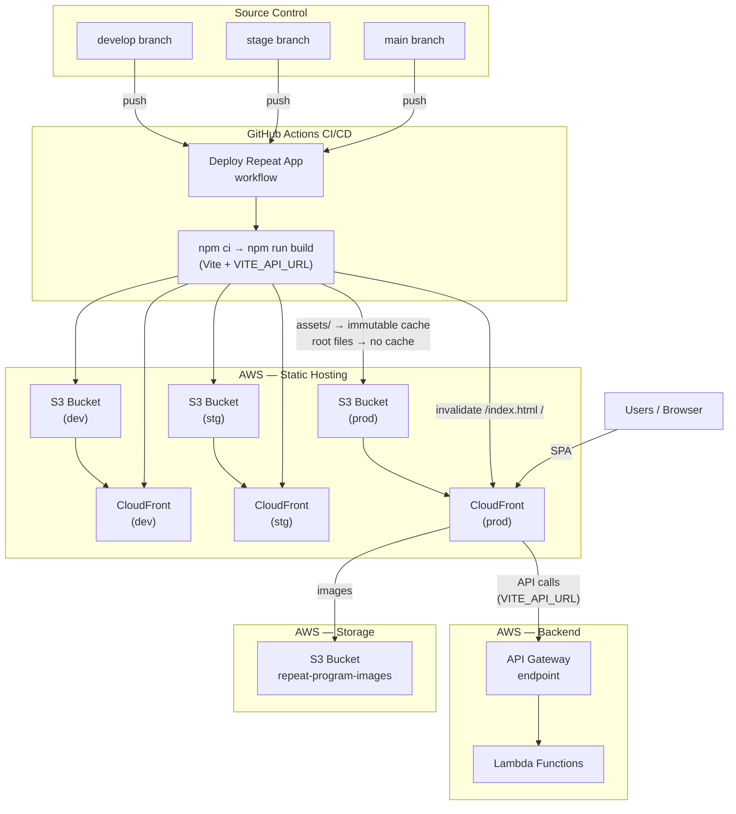

# Deployment Architecture

## Overview

Repeat App is a React SPA deployed to AWS S3 + CloudFront via GitHub Actions. The backend (Lambda + API Gateway) is managed in a separate repository.

## Diagram

## Environments

| Environment | Branch    | Trigger        |
| ----------- | --------- | -------------- |
| dev         | `develop` | push or manual |
| stg         | `stage`   | push or manual |
| prod        | `main`    | push or manual |

All environments also support `workflow_dispatch` for manual deploys with environment selection.

## Build & Deploy Pipeline

1. **Checkout** code from the triggered branch
2. **Setup Node.js** (version from `.nvmrc`)
3. **Install** dependencies with `npm ci`
4. **Build** with `npm run build` — Vite injects `VITE_API_URL` per environment
5. **Sync hashed assets** (`dist/assets/`) to S3 with `Cache-Control: public, max-age=31536000, immutable`
6. **Sync root files** (`dist/` excluding assets) to S3 with `Cache-Control: public, max-age=0, must-revalidate`
7. **Invalidate CloudFront** cache for `/index.html` and `/`

## Secrets & Variables (GitHub Environments)

| Type     | Name                             | Description                           |
| -------- | -------------------------------- | ------------------------------------- |
| Secret   | `AWS_ACCESS_KEY_ID`              | IAM credentials for S3/CloudFront     |
| Secret   | `AWS_SECRET_ACCESS_KEY`          | IAM credentials for S3/CloudFront     |
| Variable | `VITE_API_URL`                   | Backend API Gateway URL               |
| Variable | `AWS_S3_BUCKET`                  | Target S3 bucket name                 |
| Variable | `AWS_CLOUDFRONT_DISTRIBUTION_ID` | CloudFront distribution to invalidate |

## Releases

Automated via [release-please](https://github.com/googleapis/release-please) (`.github/workflows/release-please.yml`). On pushes to `stage`, release-please analyzes Conventional Commit messages and maintains an open release PR. Merging that PR:

1. Bumps `version` in `package.json` and `.release-please-manifest.json`
2. Updates `CHANGELOG.md`
3. Creates a GitHub Release with a `vX.Y.Z` tag
4. The merge commit triggers `deploy.yml`, deploying the release to stg automatically

## Cache Strategy

- **Hashed assets** (`/assets/*`): Long-lived immutable cache (1 year). Vite generates unique filenames on each build, so old cached files are never served for new code.
- **Root files** (`index.html`, etc.): No cache (`must-revalidate`). Ensures users always get the latest `index.html` which references the current hashed assets.
- **CloudFront invalidation**: Only `/index.html` and `/` are invalidated — hashed assets don't need invalidation since their filenames change on each build.
